# Important Note


If you haven't read the blog post regarding currency analysis with MongoDB, please have a look at it first: https://www.mongodb.com/developer/article/time-series-candlestick/

If you want to skip building & deploying this demo toolkit and would like to see a live demo, please check this following MongoDB Realm Application: https://cryptocurrencyanalysis-mqfhc.mongodbstitch.com/ . Given MongoDB Realm Web application has more features than this demo toolkit and source code of that MongoDB Realm Web Application will be published soon, stay tuned. 


# Currency Analysis with MongoDB Time-Series Collection and Windowing Operators
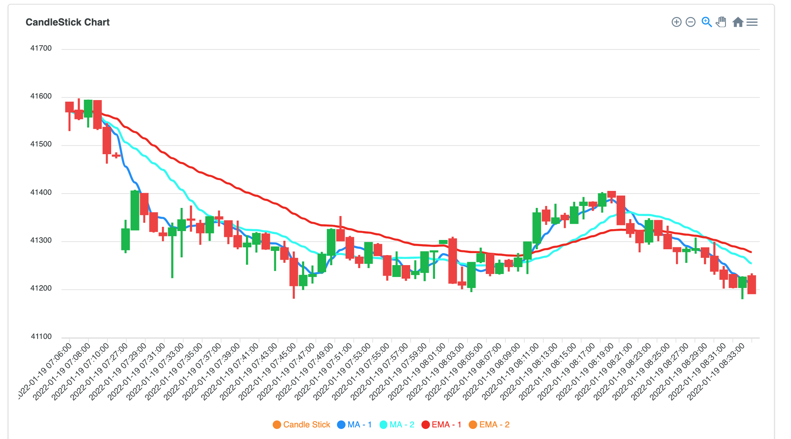&nbsp;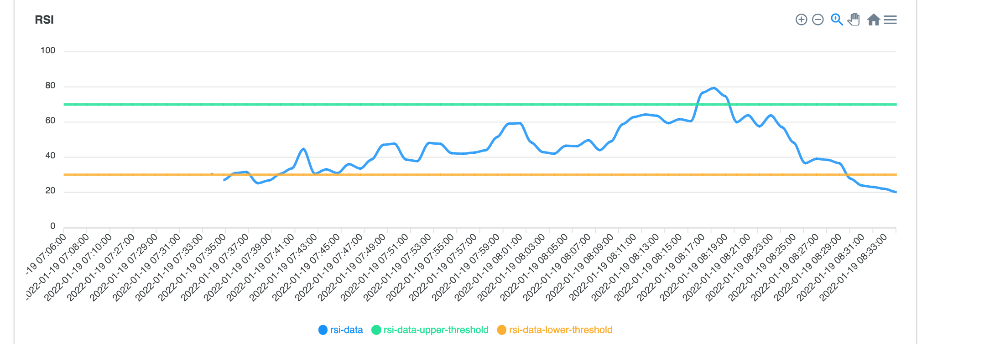&nbsp;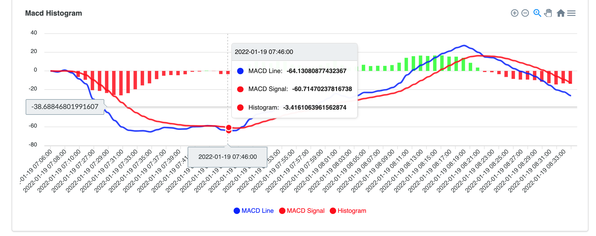

In this demo toolkit, you can test how newly introduced time-series collections works in MongoDB 5.0.  

Either you can refer to section [Quick Install](#1-quick-install-with-docker) to build and deploy required docker containers OR you can build / modify / observe the components and deploy manually. 


- [How it works?](#how-it-works-)
- [Installation](#installation)
- [1. Quick Install with Docker](#1-quick-install-with-docker)
  * [1.1. Pre-Requisites](#11-pre-requisites)
  * [1.2. Time to Complete](#12-time-to-complete)
  * [1.3. Clone the repository](#13-clone-the-repository)
  * [1.4. What will I have after installation](#14-what-will-i-have-after-installation)
  * [1.5. Running the Commands](#15-running-the-commands)
    + [1.5.1 Change directory to the cloned/downloaded folder](#151-change-directory-to-the-cloned-downloaded-folder)
    + [1.5.2 Set the Required Environment Variables](#152-set-the-required-environment-variables)
    + [1.5.3. Setting up the MongoDB database](#153-setting-up-the-mongodb-database)
      - [Remove all mongodb-timeseries images](#remove-all-mongodb-timeseries-images)
      - [Making sure environment variables are set](#making-sure-environment-variables-are-set)
      - [1.5.3.1 Build the MongoDB 5.0 image](#1531-build-the-mongodb-50-image)
      - [1.5.3.2 Run the MongoDB 5.0 Container as Single Node](#1532-run-the-mongodb-50-container-as-single-node)
      - [1.5.3.3 Create a time-series collection](#1533-create-a-time-series-collection)
  * [1.5.4. Setting up Frontend/Backend/Loader Components](#154-setting-up-frontend-backend-loader-components)
      - [1.5.4.1 Build frontend/backend/data loader docker images](#1541-build-frontend-backend-data-loader-docker-images)
      - [1.5.4.2 Run frontend/backend/data loader docker containers](#1542-run-frontend-backend-data-loader-docker-containers)
- [2. Observations](#2-observations)
  * [2.1. Web Interface](#21-web-interface)
  * [2.2. Individual Currency Analysis](#22-individual-currency-analysis)
    + [Latest Information](#latest-information)
    + [Filter setting](#filter-setting)
    + [2.2.1. Example filter setting - 1](#221-example-filter-setting---1)
    + [2.2.1. Example filter setting - 2](#221-example-filter-setting---2)
  * [2.3. Top & Worst Performers](#23-top---worst-performers)
- [3. Under the hood](#3-under-the-hood)
  * [3.1. How data is inserted](#31-how-data-is-inserted)


# How it works?

Review the end-to-end architecture in the below. 

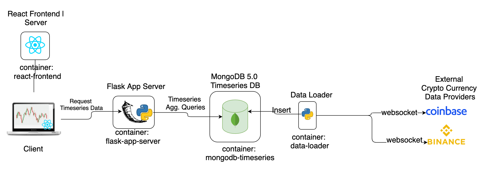

Before starting any interaction with the database, the MongoDB Time-Series collection should be ready. Please check the file `db-scripts/init.js` that prepare the time-series collection with the necessary indexes. 

A python utility `data-loader` establishes a WebSocket connection to one of the crypto currency exchanges either [Coinbase](https://www.coinbase.com/) or [Binance](https://www.binance.com/en) . After WebSocket connection has been established successfully, this utility will start to consume WebSocket data, inserts the currency data into MongoDB Time-Series collection.

While data being inserted into MongoDB Time-Series collection, bucketing is going to be handled automatically. Bucketing allows faster data access and less storage requirements and it's been handled by the database user by applying [Bucketing design pattern](https://www.mongodb.com/blog/post/building-with-patterns-the-bucket-pattern#:~:text=When%20working%20with%20time%2Dseries%20data%2C%20using%20the%20Bucket%20Pattern,works%20great%20for%20many%20cases).

An end user can access to `Flask` backend server through `React` frontend server to analyse currency prices by applying moving average, exponential moving average statistical methods which was introduced with MongoDB 5.0. Besides, user can also see the ranking for the given period (e.g. top 3 performed currencies every 5 minutes).

# Installation

# 1. Quick Install with Docker

## 1.1. Pre-Requisites

Docker Engine needs to be already installed. If it's already been installed, update to the latest version.
Successfully tested on the Mac OS 11.3.1 and with the following docker version:

```bash
└─ $ ▶ docker --version
Docker version 20.10.5, build 55c4c88
└─ $ ▶ docker-compose --version
docker-compose version 1.28.5, build c4eb3a1f
```

## 1.2. Time to Complete 

It will take approximately 15 minutes to build and run all the necessary containers.

## 1.3. Clone the repository 

Either download or use `git clone` to clone this repository. And switch to the proper branch through `git checkout timeseries-currency-analysis` 

## 1.4. What will I have after installation

After you clone / download this repository and follow the given steps, you will end up having 4 containers:

- A container has MongoDB 5.0 with a time-series collection
- A container has Data Loader which consumes data from Binance Crypto Currency Exchange (default)
  - If you wish, you can change it to Coinbase
- A container has Flask App Server has REST endpoints and responds to the requests triggered by the user interface
- A container has a React-Frontend server

## 1.5. Running the Commands

Execute the given below commands in the project folder after you clone the repository.

### 1.5.1 Change directory to the cloned/downloaded folder

Set the current working directory to the cloned repository / proper folder. 

```bash
└─ $ ▶ cd mongodb-timeseries-currency-analysis/
```

### 1.5.2 Set the Required Environment Variables

These environment variables will be passed to the necessary containers for the runtime activities. You can check the content of fhe file with `$ cat .env` 

Set the environment variables for the session.

```bash
. .env
```

Check a few environment variables whether they have been set or not: 

```bash
└─ $ ▶ echo ${FLASK_APP_SERVER_PORT} ${FLASK_APP_SERVER_PUBLIC_HOST} ${MONGODB_DATABASE_HOSTNAME}
7000 localhost mongodb-timeseries
```

If you've seen the above output, you can proceed the next step.

### 1.5.3. Setting up the MongoDB database


#### Remove all mongodb-timeseries images 

If you've already built the docker images but not able to run and want to do everything from scratch, you can remove the already built mongodb timeseries demo toolkit images with the following command:
```bash
└─ $ ▶ docker images -a | grep "mongodb-timeseries" | awk '{print $3}' | xargs docker rmi -f

```

#### Making sure environment variables are set

Before running the containers, please make sure that you have successfully set the environment variable. However, you can manually execute the following command just before running the containers:

```bash
. .env
```

#### 1.5.3.1 Build the MongoDB 5.0 image

Below command builds a docker image with the latest MongoDB 5.0 build by fetching the tar file from `https://fastdl.mongodb.org/linux/mongodb-linux-x86_64-ubuntu1804-latest.tgz` . For the details of image, check the file `Dockerfile.database` .

Note: Since MongoDB 5.0 is still in Alpha version, there might be change in the interaction of the database. 

 In order to build docker image, execute the following command:

```bash
└─ $ ▶ docker-compose build --no-cache mongodb-timeseries
```

You will see an output like this: ```Successfully built 1f8e769884a10e7e6ee29341b5a4f59953523a5ed440ae34d2d3cfc3895f02ae```

After you built the image, execute the following command to test that image has been built properly: (You need to see the image "mongodb-timeseries-currency-analysis_mongodb-timeseries")

```bash
└─ $ ▶ docker image ls
REPOSITORY                                                TAG       IMAGE ID       CREATED         SIZE
mongodb-timeseries-currency-analysis_mongodb-timeseries   latest    1f8e769884a1   2 minutes ago   917MB
```


#### 1.5.3.2 Run the MongoDB 5.0 Container as Single Node

Now, we are launching our database: (it's a single node MongoDB)

```bash
└─ $ ▶ docker-compose up mongodb-timeseries
```

You will see a bunch of database logs similar to this:

```
mongodb-timeseries_1  | {"t":{"$date":"2021-05-25T07:06:07.495+00:00"},"s":"I",  "c":"CONTROL",  "id":4615611, "ctx":"initandlisten"
```

Now our database container is ready to accept requests, this session will show the database log as soon as the database produces output.

#### 1.5.3.3 Create a time-series collection

Open another shell session in the same project directory.

Observe the `init.js` file under the `db-scripts` folder. 

```bash
└─ $ ▶ cat db-scripts/init.js
```

While we were building database image, `db-scripts/init.js` file has already been copied into the image, at the path `/tmp/init.js` in the image. Though, the volume mechanism of docker could have been used. 

Run the below command to execute given database script file in the running MongoDB 5.0 database:

```bash
└─ $ ▶ docker-compose exec mongodb-timeseries sh -c "/root/mongo_executables/bin/mongo < /tmp/init.js"
```

You'll see the below output which shows the created collection details and created indexes, you need to see similar output:

```bash
MongoDB shell version v5.0.0-alpha0-584-g325ff69
connecting to: mongodb://127.0.0.1:27017/?compressors=disabled&gssapiServiceName=mongodb
Implicit session: session { "id" : UUID("814176e8-92e7-41c6-bd5c-f863a564f009") }
MongoDB server version: 5.0.0-alpha0-584-g325ff69
switched to db trading
false
{ "ok" : 1 }
{
	"numIndexesBefore" : 0,
	"numIndexesAfter" : 1,
	"createdCollectionAutomatically" : false,
	"ok" : 1
}
{
	"numIndexesBefore" : 1,
	"numIndexesAfter" : 2,
	"createdCollectionAutomatically" : false,
	"ok" : 1
}
======================
Collection details:
[
	{
		"name" : "system.buckets.ticker",
		"type" : "collection",
		"options" : {
			"storageEngine" : {
				"wiredTiger" : {
					"configString" : "block_compressor=zstd"
				}
			},
			"validator" : {
				"$jsonSchema" : {
					"bsonType" : "object",
...
...
...
...
		"info" : {
			"readOnly" : false
		}
	}
]
======================
Indexes:
[
	{
		"v" : 2,
		"key" : {
			"symbol" : 1
		},
		"name" : "symbol_1"
	},
	{
		"v" : 2,
		"key" : {
			"time" : 1,
			"symbol" : 1
		},
		"name" : "time_1_symbol_1"
	}
]
bye
```

And, you can also see the changes in the database output log (it was opened in the previous step).

For example, at the right pane of the shell, we executed the `init.js` script and in the left pane we can see the database logs about this operation.

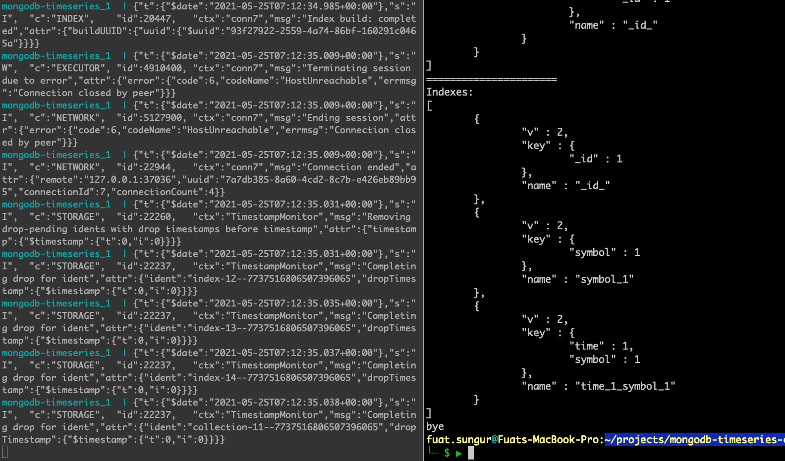

## 1.5.4. Setting up Frontend/Backend/Loader Components 

Until now, we have built the database image and run it as a container, and execute both the create script of time-series collection and the index creation scripts. 

Now, it's time to build the complementary part of end-to-end architecture.

#### 1.5.4.1 Build frontend/backend/data loader docker images

We will build 3 other images (frontend, backend, data-loader).

Run the below command:

```bash
└─ $ ▶ docker-compose build --no-cache react-frontend flask-app-server data-loader
```

You need to see separate 3 ```Successfully built``` messages that specifies building images are successful.

After you build the images, execute the below command to see the built images:

```bash
└─ $ ▶ docker image ls --filter "reference=mongo*"
```

You need to see below images for this demo toolkit:

```bash
REPOSITORY                                                TAG       IMAGE ID       CREATED         SIZE
mongodb-timeseries-currency-analysis_react-frontend       latest    ff593b5c5f9f   2 minutes ago   522MB
mongodb-timeseries-currency-analysis_flask-app-server     latest    f2653be29e4e   3 minutes ago   302MB
mongodb-timeseries-currency-analysis_data-loader          latest    c75e58b91fbe   4 minutes ago   298MB
mongodb-timeseries-currency-analysis_mongodb-timeseries   latest    f00f37334a43   7 minutes ago   917MB
```


#### 1.5.4.2 Run frontend/backend/data loader docker containers

Our 3 components' docker images are ready (frontend/backend/data loader). Now it's time to run them as 3 separate containers.

Run the below command:

```bash
└─ $ ▶ docker-compose up react-frontend flask-app-server data-loader
```

Output should be similar to below:

```bash
WARNING: Found orphan containers (mongodb-timeseries-currency-analysis_web_1, mongodb-timeseries-currency-analysis_db_1) for this project. If you removed or renamed this service in your compose file, you can run this command with the --remove-orphans flag to clean it up.
mongodb-timeseries-currency-analysis_mongodb-timeseries_1 is up-to-date
Recreating mongodb-timeseries-currency-analysis_flask-app-server_1 ... done
Recreating mongodb-timeseries-currency-analysis_data-loader_1      ... done
Recreating mongodb-timeseries-currency-analysis_react-frontend_1   ... done
Attaching to mongodb-timeseries-currency-analysis_flask-app-server_1, mongodb-timeseries-currency-analysis_data-loader_1, mongodb-timeseries-currency-analysis_react-frontend_1
data-loader_1         | 2021-05-24 10:39:38,294 - root - INFO - Parameters: binance, wss://stream.binance.com:9443/ws/!ticker@arr
flask-app-server_1    |  * Serving Flask app "server" (lazy loading)
flask-app-server_1    |  * Environment: production
flask-app-server_1    |    WARNING: This is a development server. Do not use it in a production deployment.
flask-app-server_1    |    Use a production WSGI server instead.
flask-app-server_1    |  * Debug mode: on
flask-app-server_1    |  * Running on all addresses.
flask-app-server_1    |    WARNING: This is a development server. Do not use it in a production deployment.
flask-app-server_1    |  * Running on http://172.19.0.4:7000/ (Press CTRL+C to quit)
flask-app-server_1    |  * Restarting with stat
data-loader_1         | 2021-05-24 10:39:38,954 - root - INFO - Successful: Websocket has been establised to BINANCE platform ...
flask-app-server_1    |  * Debugger is active!
flask-app-server_1    |  * Debugger PIN: 581-214-361
data-loader_1         | 2021-05-24 10:39:40,196 - root - INFO - 752 currency data has been retrieved from socket and 162 of them have been inserted. Example retrieved record: {'symbol': 'MDXUSDT', 'time': datetime.datetime(2021, 5, 24, 10, 39, 39), 'price': 1.9472, 'volume': 11137615.98}.
react-frontend_1      |
react-frontend_1      | > frontend-crypto-currency@0.1.0 start
react-frontend_1      | > react-scripts start
react-frontend_1      |
data-loader_1         | 2021-05-24 10:39:40,898 - root - INFO - 721 currency data has been retrieved from socket and 161 of them have been inserted. Example retrieved record: {'symbol': 'MDXUSDT', 'time': datetime.datetime(2021, 5, 24, 10, 39, 40), 'price': 1.9472, 'volume': 11137615.98}.
data-loader_1         | 2021-05-24 10:39:41,884 - root - INFO - 795 currency data has been retrieved from socket and 200 of them have been inserted. Example retrieved record: {'symbol': 'MDXUSDT', 'time': datetime.datetime(2021, 5, 24, 10, 39, 41), 'price': 1.9472, 'volume': 11137615.98}.
data-loader_1         | 2021-05-24 10:39:42,889 - root - INFO - 769 currency data has been retrieved from socket and 192 of them have been inserted. Example retrieved record: {'symbol': 'MDXUSDT', 'time': datetime.datetime(2021, 5, 24, 10, 39, 42), 'price': 1.9472, 'volume': 11137615.98}.
data-loader_1         | 2021-05-24 10:39:43,899 - root - INFO - 769 currency data has been retrieved from socket and 180 of them have been inserted. Example retrieved record: {'symbol': 'MDXUSDT', 'time': datetime.datetime(2021, 5, 24, 10, 39, 43), 'price': 1.9443, 'volume': 11137672.87}.
```

You will see streaming of logs from the container `data-loader_1` because it fetches the data from the WebSocket provider and inserts into the database. Every second hundreds of records are inserted into the database.

Important Note:

If you want to re-build every image from scratch remove the images first and then build without using cache, for example: 

```bash
└─ $ ▶ docker-compose rm mongodb-timeseries
└─ $ ▶ docker-compose build --no-cache mongodb-timeseries
```

# 2. Observations

If you've already built images and the run 4 containers then you can start to observe.

Time to complete: 15 minutes

## 2.1. Web Interface 

After you start the containers wait for a while.

Access the following page: `http://localhost:9121/` where React server accepts the requests. (It might take for a while React server to be ready -1-2 minutes). Please find the "`react-frontend_1 Compiled`" message to be sure react development server successfully run. 

Note: If you've already modified the ports, you need to change the host/port info to access home page.

You will see the following home page.

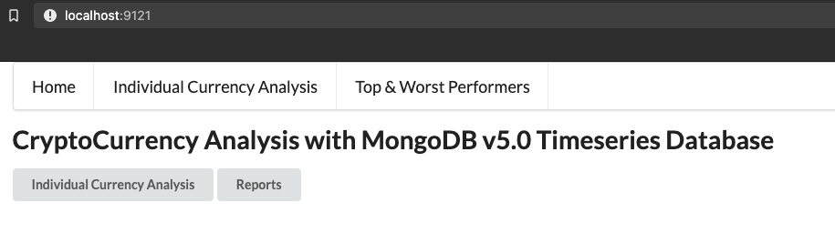

There are 2 main pages, **Individual Currency Analysis** and **Top & Worst Performers**.

## 2.2. Individual Currency Analysis

Click Individual Currency Analysis.

On this page, you can analyze the currency data based on given interval while applying some statistical currency analysis methods (Moving Average (MA), Exponential Moving Average (EMA)) and technical indicators (MACD and RSI).

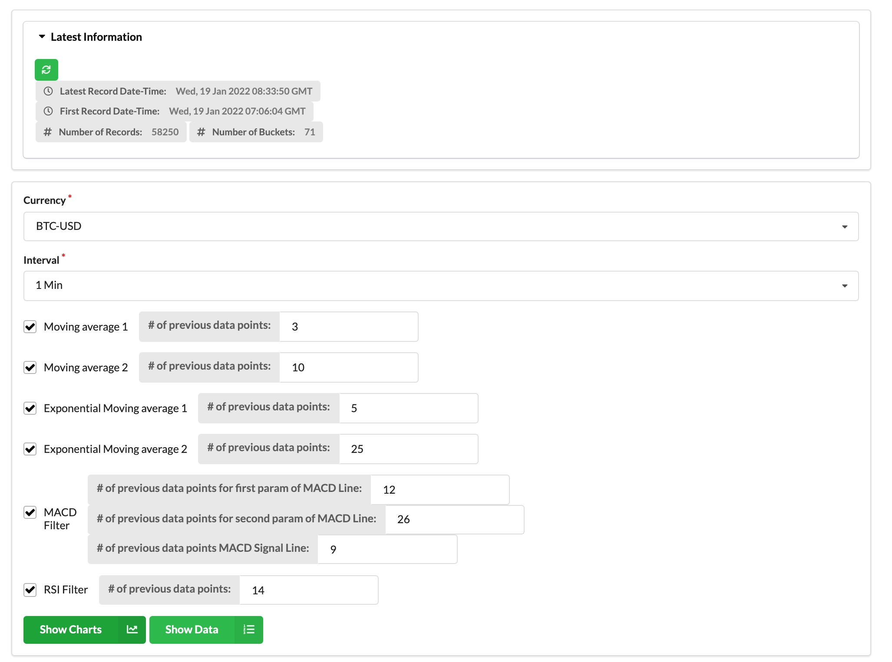

### Latest Information

In this section you can find some high-level statistics about the time-series collections. You can refresh the statistics by hitting refresh button in this section.


### Filter setting
Set the parameters accordingly.

- Choose a currency
  - Currency is listed in the exchange and the value of currency gives the ratio between two units. e.g. the value of the currency `BNBBUSD` provides the ratio between coin/token `BNB` to coin/token `BUSD`.
- Choose an interval 
  - Based on the chosen interval, an aggregation query to analyze time-series data is generated by using the `$dateTrunc` operator which has been introduced with MongoDB 5.0. It truncates the date value to the closest bucket. e.g. if you choose 5 minutes interval then the values  in the time `22:43:03` and `22:44:15`, will be in the same group (`22:40:00`) however if you have some data in the time `22:48:03` then it will be in the next group (`22:45:00`).
- Choose one or more statistical analysis methods. (Optional)
  - You can choose multiple methods to analyze the chosen currency to predict possible buy/sell points.
  - Moving average
    -  Requires one parameter that sets the boundary of the moving window 
      - e.g. if the interval is `1 minute` and if the moving average parameter is `5`  then the moving average of the current time point is calculated based on the previous 5-minute buckets data + existing interval document. 
        - e.g. interval is `1 minute` and MA (moving average) parameter is `5`
          - Currency data starts at 22:00:00
          - 22:00:00 - {value:10, MA: 10}
          - 22:01:00 - {value:12, MA: 11}
          - 22:02:00 - {value:14, MA: 12}
          - 22:03:00 - {value:16, MA: 13}
          - 22:04:00 - {value:18, MA: 14}
          - 22:05:00 - {value:20, MA: 15}
          - 22:06:00 - {value:22, MA: 17}
          - 22:05:00 - {value:24, MA: 19}
          - 22:05:00 - {value:26, MA: 21}
      - MongoDB has introduced `$setWindowFields` operator that executes some calculations on the moving window and it accepts parameters to set the boundary. e.g. how old data needs to be included in the moving window OR how many previous data points need to be included in the window
  - Exponential Moving Average
    - It's similar to moving average but the weight of the recent values are higher than the much older data. Therefore we can expect that EMA (exponential moving average) reacts to the recent changes faster than MA. For more info check [Investopedia](https://www.investopedia.com/terms/e/ema.asp).
  - MACD and RSI 

Based on your criteria, you'll see Candle Stick, RSI and MACD charts. In order to  see RSI data properly you need at least the number of data points that you specified in the filter (default: 14).


### 2.2.1. Example filter setting - 1

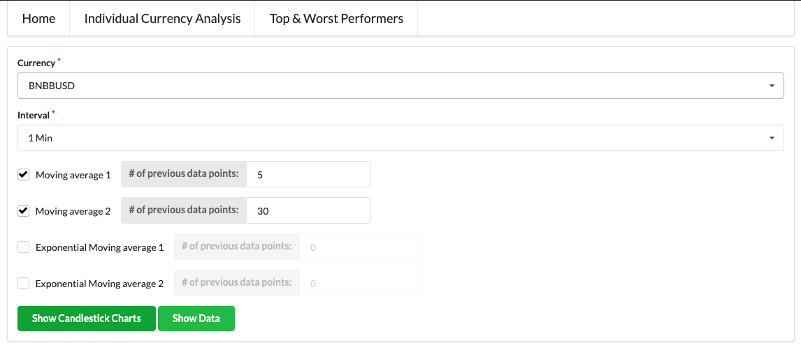

Click `Show Candlestick Charts` .

You will see the chart will be generated based on the retrieved data from MongoDB. As you see MA with the parameter `5` reacts faster to the recent price changes than the MA with the parameter `30`.

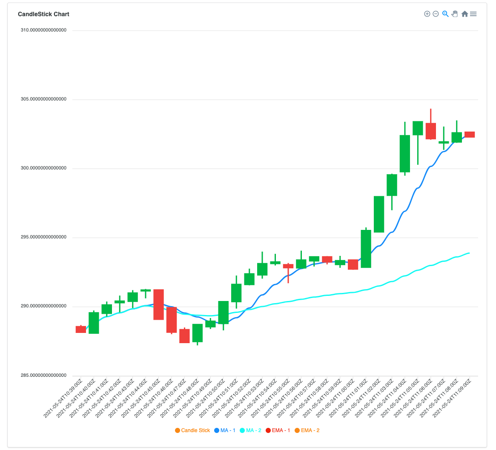

You can also see the generated MongoDB Aggregation Query on the same page:

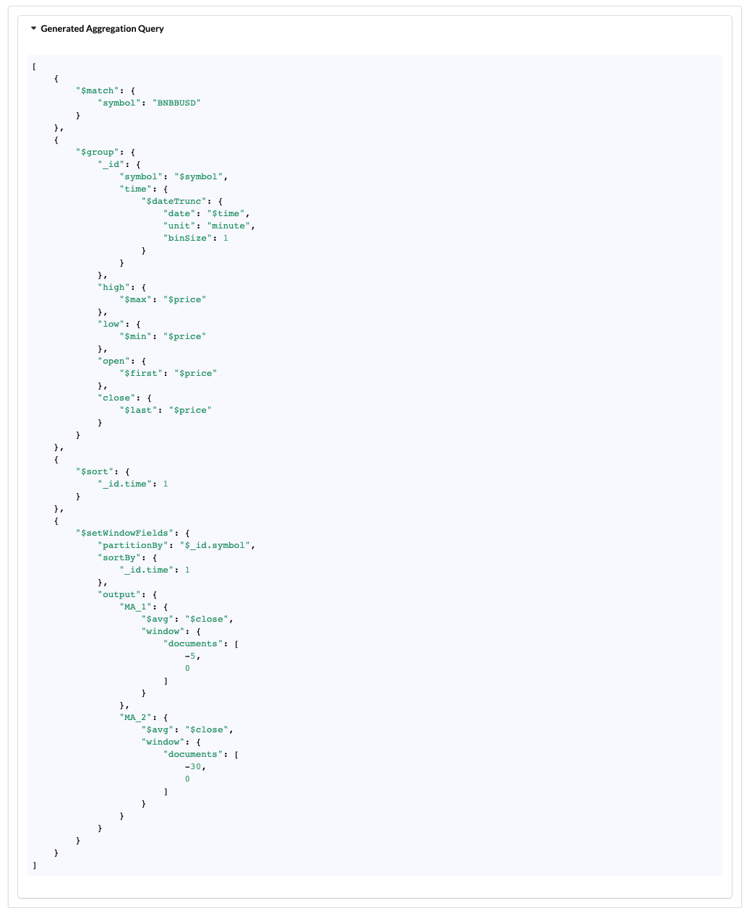

You can see the `$setWindowFields` operator that has been newly introduced with MongoDB 5.0. It partitions the input stream data by currency symbol and sort the data by the time and then calculates the different moving average with different parameters (previous 5 and 30 intervals).

You can also click the `Show Data` button to see the retrieved data from MongoDB.

### 2.2.1. Example filter setting - 2

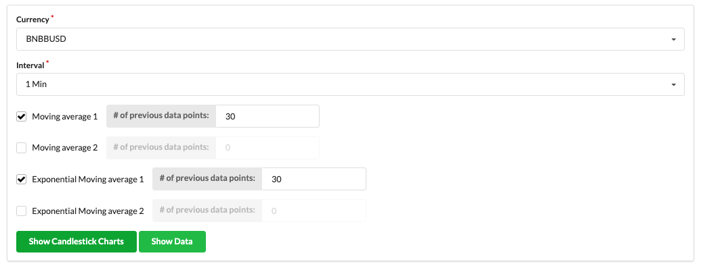

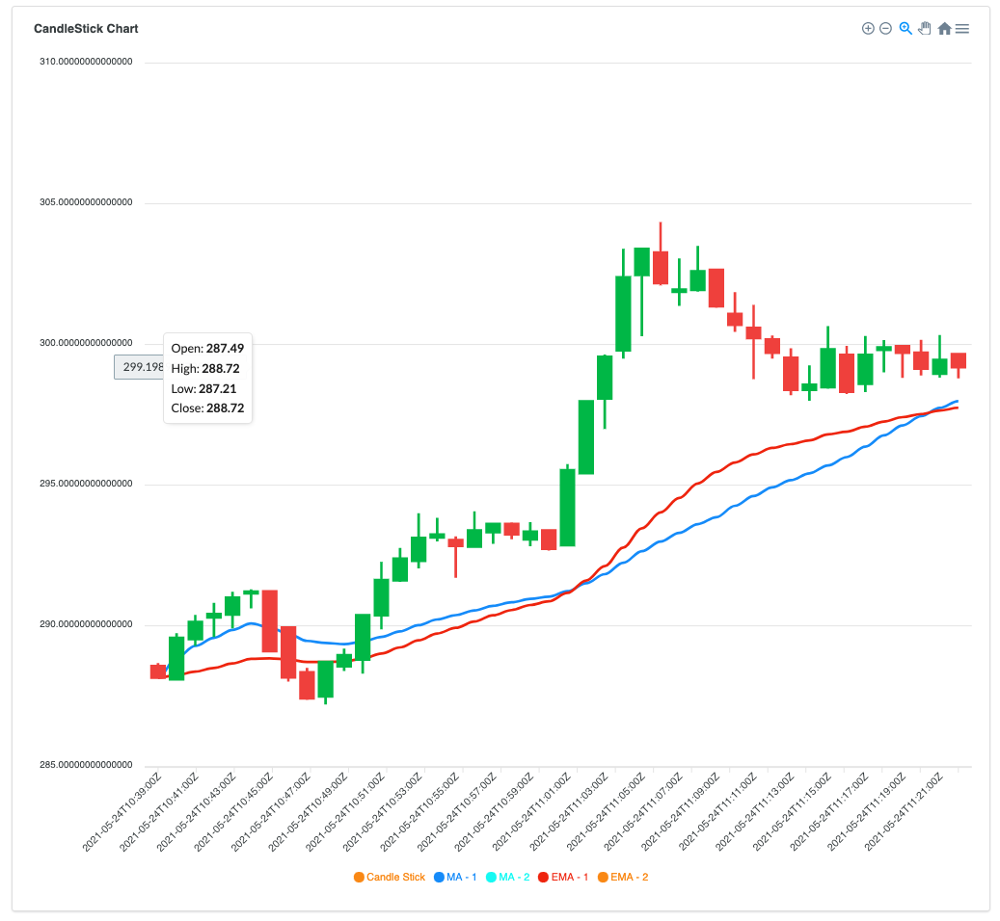

As you see in the time between 2021-05-24T11:01:00Z to 2021-05-24T11:10:00Z, EMA reacts to recent data changes more than MA (with the same number of previous data points parameter).

You can see the generated query as shown in the below: 

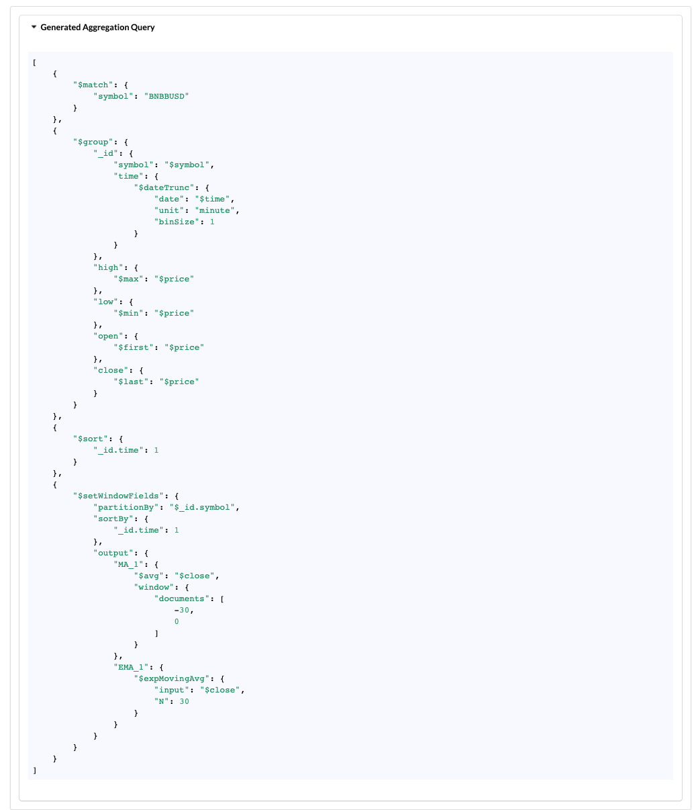

`$expMovingAvg` requires a parameter `N` or `alpha` that impacts the result. `N` equals number of previous data points to consider and we provided `30` for this example. 

## 2.3. Top & Worst Performers

You can also observe the Top 3 and Worst 3 Performs for every X minutes over a period of time.

Click the `Top & Worst Performers` menu in the top.

Set the filter.

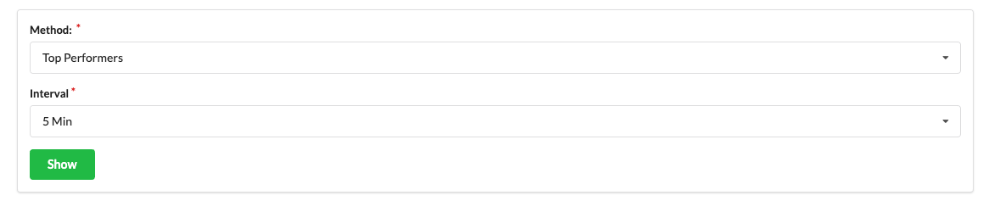

Based on the chosen interval, Top 3 Currencies for each bucket/interval (e.g. 5 minutes) will be displayed.

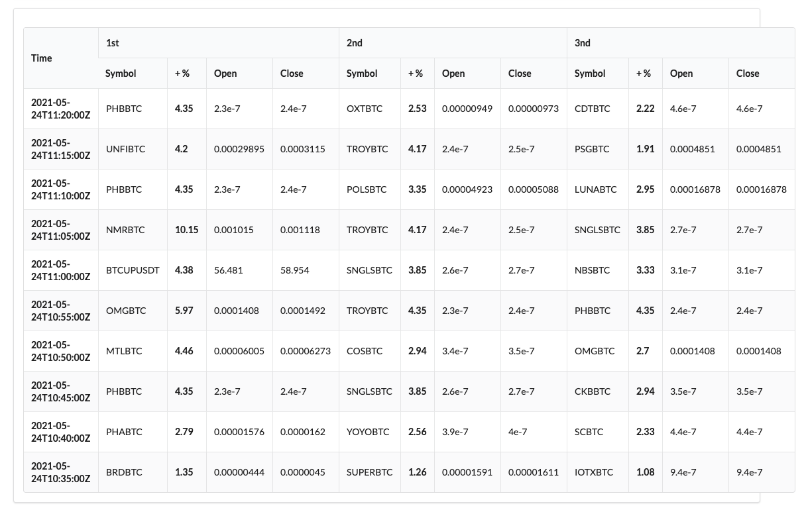

In the generated query section, you can see the generated aggregation query.

MongoDB 5.0 introduced a new operator, `$rank` which assigns the rank value for sorted data. 


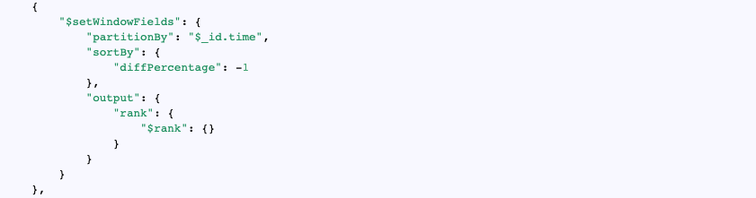


# 3. Under the hood

## 3.1. How data is inserted

Every second, the utility which is running in the container `data-loader` retrieves a WebSocket message which includes hundreds of currency message. And this utility converts every currency data to a `dict` object in `python` and batches it and then executes `insert_many` procedure of `pymongo`. Every individual currency data is inserted into `ticker` collection with the `symbol`, `price`, `time` information:

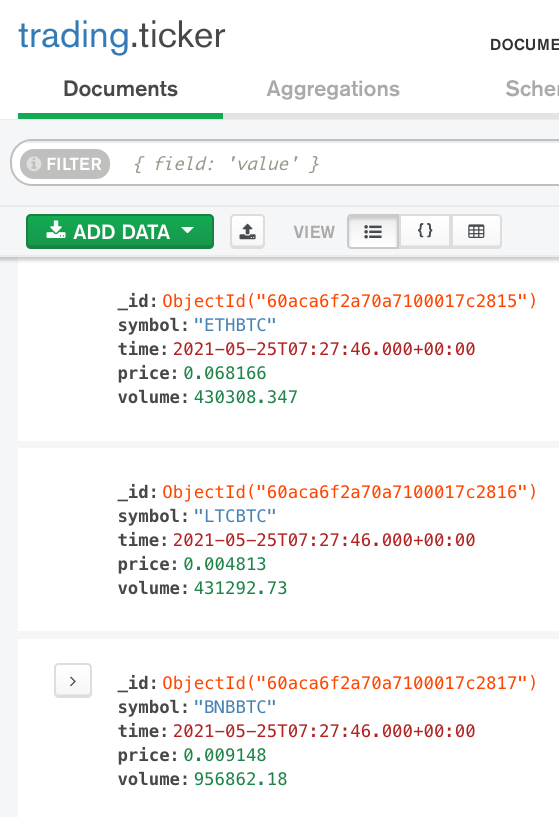


However, under the hood, time-series collection keeps another collection that store the data in a different format than the above one. It automatically creates bucketing based on the given metadata, time, measure information.

In order to access the database and see this collection, do the following steps.

**Find out the container id of the database**

```bash
└─ $ ▶ docker container ps --filter "name=mongodb-timeseries-currency-analysis_mongodb-timeseries" --format "{{.ID}}"
be14a8466cc2
```

**Access to bash utility of that container**

```bash
└─ $ ▶ docker exec -it be14a8466cc2 bash
root@be14a8466cc2:/#
```

In the docker container execute the following command to access database shell:

```bash
root@be14a8466cc2:/# ./root/mongo_executables/bin/mongo
MongoDB shell version v5.0.0-alpha0-602-gb334917
connecting to: mongodb://127.0.0.1:27017/?compressors=disabled&gssapiServiceName=mongodb
Implicit session: session { "id" : UUID("25b512f6-340f-44e0-8de6-28ddf6375b00") }
MongoDB server version: 5.0.0-alpha0-602-gb334917
Welcome to the MongoDB shell.
```

Execute the `show collections` command to see all collections:

```bash
> show collections
system.buckets.ticker
system.views
ticker
```

As you see there is another collection `system.buckets.ticker`. Let's check a record.

```bash
> db.system.buckets.ticker.findOne()
{
	"_id" : ObjectId("60acb32baaac0dbd3d6ef2da"),
	"control" : {
		"version" : 1,
		"min" : {
			"_id" : ObjectId("60acb32c5993d200017e96f9"),
			"time" : ISODate("2021-05-25T08:19:55Z"),
			"price" : 0.0000285,
			"volume" : 7263989
		},
		"max" : {
			"_id" : ObjectId("60acb38e5993d200017eeaab"),
			"time" : ISODate("2021-05-25T08:21:34Z"),
			"price" : 0.0000286,
			"volume" : 7266972
		}
	},
	"meta" : "IOTABTC",
	"data" : {
		"_id" : {
			"0" : ObjectId("60acb32c5993d200017e96f9"),
			"1" : ObjectId("60acb32d5993d200017e97be"),
			"2" : ObjectId("60acb32e5993d200017e9899"),
			"3" : ObjectId("60acb32f5993d200017e996c"),
			"4" : ObjectId("60acb3305993d200017e9a49"),
			"5" : ObjectId("60acb3315993d200017e9b18"),
			"6" : ObjectId("60acb3325993d200017e9beb"),
			"7" : ObjectId("60acb3335993d200017e9cd7"),
			"8" : ObjectId("60acb3345993d200017e9dc0"),
			"9" : ObjectId("60acb3355993d200017e9ea0"),
			"10" : ObjectId("60acb3365993d200017e9f85"),
			"11" : ObjectId("60acb3375993d200017ea06b"),
			"12" : ObjectId("60acb3385993d200017ea14c"),
			"13" : ObjectId("60acb3395993d200017ea22d"),
			"14" : ObjectId("60acb33a5993d200017ea307"),
			"15" : ObjectId("60acb33b5993d200017ea3dd"),
			"16" : ObjectId("60acb33c5993d200017ea4e3"),
			"17" : ObjectId("60acb33d5993d200017ea5df"),
			"18" : ObjectId("60acb33e5993d200017ea6d2"),
			"19" : ObjectId("60acb33f5993d200017ea7c7"),
			"20" : ObjectId("60acb3405993d200017ea8b3"),
			...
			...
			"93" : ObjectId("60acb38a5993d200017ee752"),
			"94" : ObjectId("60acb38b5993d200017ee82a"),
			"95" : ObjectId("60acb38c5993d200017ee8ff"),
			"96" : ObjectId("60acb38d5993d200017ee9db"),
			"97" : ObjectId("60acb38e5993d200017eeaab")
		},
		"volume" : {
			"0" : 7265176,
			"1" : 7265084,
			"2" : 7265084,
			"3" : 7265176,
			"4" : 7265167,
			"5" : 7265167,
			"6" : 7264067,
			"7" : 7264029,
			"8" : 7264029,
			"9" : 7264043,
			"10" : 7264047,
			"11" : 7264047,
			"12" : 7264047,
			"13" : 7264047,
			"14" : 7264047,
			...
			...
			"93" : 7266859,
			"94" : 7266159,
			"95" : 7266159,
			"96" : 7266159,
			"97" : 7266159
		},
		"time" : {
			"0" : ISODate("2021-05-25T08:19:55Z"),
			"1" : ISODate("2021-05-25T08:19:57Z"),
			"2" : ISODate("2021-05-25T08:19:58Z"),
			"3" : ISODate("2021-05-25T08:19:59Z"),
			"4" : ISODate("2021-05-25T08:20:00Z"),
			"5" : ISODate("2021-05-25T08:20:01Z"),
			"6" : ISODate("2021-05-25T08:20:02Z"),
			"7" : ISODate("2021-05-25T08:20:03Z"),
			"8" : ISODate("2021-05-25T08:20:04Z"),
			"9" : ISODate("2021-05-25T08:20:05Z"),
			"10" : ISODate("2021-05-25T08:20:06Z"),
			"11" : ISODate("2021-05-25T08:20:07Z"),
			"12" : ISODate("2021-05-25T08:20:08Z"),
			"13" : ISODate("2021-05-25T08:20:09Z"),
			"14" : ISODate("2021-05-25T08:20:10Z"),
			...
			...
			"91" : ISODate("2021-05-25T08:21:28Z"),
			"92" : ISODate("2021-05-25T08:21:29Z"),
			"93" : ISODate("2021-05-25T08:21:30Z"),
			"94" : ISODate("2021-05-25T08:21:31Z"),
			"95" : ISODate("2021-05-25T08:21:32Z"),
			"96" : ISODate("2021-05-25T08:21:33Z"),
			"97" : ISODate("2021-05-25T08:21:34Z")
		},
		"price" : {
			"0" : 0.00002851,
			"1" : 0.00002851,
			"2" : 0.00002851,
			"3" : 0.0000285,
			"4" : 0.0000285,
			"5" : 0.0000285,
			"6" : 0.0000285,
			"7" : 0.0000285,
			"8" : 0.0000285,
			"9" : 0.00002851,
			"10" : 0.00002852,
			"11" : 0.00002852,
			"12" : 0.00002852,
			"13" : 0.00002852,
			"14" : 0.00002852,
			...
			...
      "92" : 0.00002857,
			"93" : 0.00002857,
			"94" : 0.00002857,
			"95" : 0.00002857,
			"96" : 0.00002857,
			"97" : 0.00002857
		}
	}
}
```


As you see above, every record in the time bucket has corresponding measures (price & volume). 

**Should I manually clean the old data?**

No, while creating the time-series collection we can pass the parameter `expireAfterSeconds` which works like a TTL index therefore it removes the older data from the collection. Please check `db-scripts/init.js` file to see how it's been implemented.
